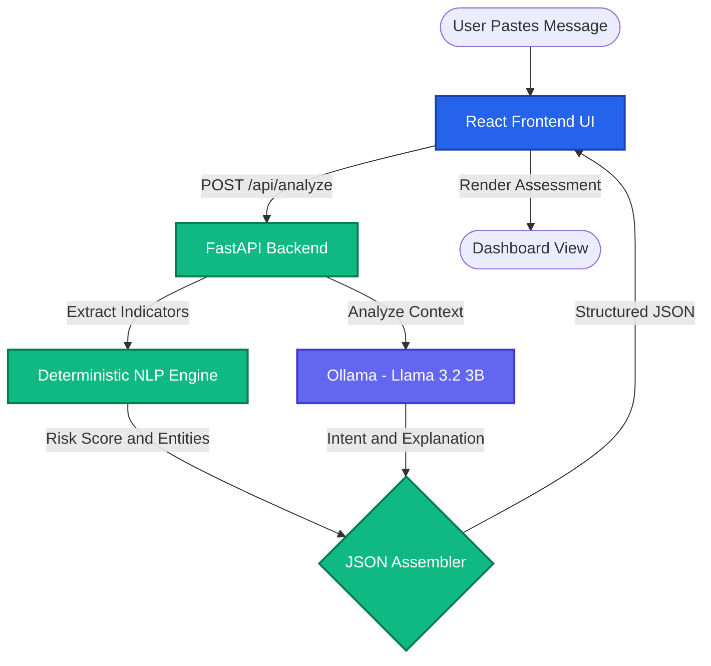

<div align="center">
  
  <h1 align="center">CyberGuard</h1>
  
  <p align="center">
    <strong>An Academic Prototype for AI-Powered Message Security Analysis</strong>
    <br />
    <i>Empowering users with Local NLP and Conversational AI to detect and understand digital threats.</i>
  </p>

  <p align="center">
    <a href="https://skillicons.dev"></a>
  </p>
</div>

---

## 📖 Overview

In today's digital landscape, users frequently receive suspicious communications—phishing attempts, fake job offers, delivery scams, and impersonation messages. **CyberGuard** is an academic prototype demonstrating how Natural Language Processing (NLP) and Large Language Models (LLMs) can support cybersecurity awareness.

Instead of relying on cloud APIs that might compromise user privacy, CyberGuard utilizes a **Hybrid Local Architecture**:
1. A **Deterministic Local NLP Engine** ensures reliable extraction of threat indicators (URLs, phone numbers, OTP requests).
2. An optional **Local Ollama LLM** provides deep contextual explanation, intent detection, and conversational Q&A without sending sensitive messages over the internet.

---

## 🤖 AI Model — Llama 3.2 3B (via Ollama)

CyberGuard uses **Meta's Llama 3.2 (3 Billion parameter variant)** served locally through **Ollama**.

| Property | Details |
|---|---|
| **Model Name** | `llama3.2:3b` |
| **Developer** | Meta AI |
| **Model Family** | Llama 3.2 |
| **Architecture** | Transformer Decoder (Causal LM) |
| **Parameters** | 3.21 Billion |
| **Context Window** | 128,000 tokens |
| **Model Type** | Instruction-tuned Large Language Model (LLM) |
| **Quantization** | Q4_K_M (4-bit quantized for local efficiency) |
| **Inference Engine** | Ollama (`/api/generate` endpoint) |
| **Runs Entirely Locally** | Yes — no data leaves your machine |
| **VRAM Required** | ~2 GB GPU / runs on CPU too |

### Why Llama 3.2 3B?

- **Privacy-first:** All inference happens on your local machine. No messages are sent to external cloud APIs.
- **Lightweight:** At 3B parameters, it runs comfortably on consumer hardware (CPU or GPU).
- **Instruction-tuned:** Fine-tuned to follow natural language instructions, making it ideal for structured JSON output and conversational tasks.
- **128K context window:** Can handle long messages with full chat history context.

### How It Is Used in CyberGuard

The model is called in **two distinct modes**:

1. **Analysis Mode** — Given the raw message + pre-extracted indicators (from the local NLP engine), the model returns a structured JSON with:
   - `intent` (e.g., "Credential Theft via Urgency")
   - `category` (e.g., "Potential Phishing")
   - `explanation` (2–3 sentence contextual summary)

2. **Chat Mode** — Given the analysis context + user question, the model generates a plain-text conversational response to follow-up questions like *"What should I do next?"*

---

## ⚙️ Tech Stack

### Frontend

| Technology | Version | Purpose |
|---|---|---|
| **React** | 18 | UI component library |
| **React Router DOM** | v7 | Client-side routing (SPA) |
| **Vite** | 8 | Dev server & build tool |
| **Vanilla CSS** | — | Custom design system (dark mode, glassmorphism) |

### Backend

| Technology | Version | Purpose |
|---|---|---|
| **Python** | 3.10+ | Runtime |
| **FastAPI** | Latest | REST API framework (async) |
| **Pydantic v2** | Latest | Request/response validation & schemas |
| **Uvicorn** | Latest | ASGI server |
| **httpx** | Latest | Async HTTP client (talks to Ollama) |
| **python-dotenv** | Latest | Environment variable management |

### AI / NLP Layer

| Technology | Role |
|---|---|
| **Ollama** | Local LLM inference engine |
| **Llama 3.2 3B** (`llama3.2:3b`) | Core language model — intent detection, contextual explanation, Q&A |
| **Deterministic NLP Engine** | Python regex rules — URL/phone/OTP/urgency detection (no model needed) |

### Dev Tooling

| Tool | Purpose |
|---|---|
| **concurrently** | Runs backend + frontend simultaneously with `npm run dev:all` |
| **TypeScript** | Type safety in frontend |

---

## 🧠 Architecture

CyberGuard is designed to operate securely and efficiently. The architecture guarantees a fallback if the LLM is unavailable, ensuring the application remains resilient.



### Fallback Strategy

```
User Request
    ↓
Local NLP Engine (always runs — extracts URLs, phone numbers, keywords)
    ↓
Ollama Available?
  YES → Llama 3.2 3B enriches with intent + explanation (full analysis)
  NO  → Local NLP result only (risk score + raw indicators still returned)
```

---

## 🔬 Working Mechanism

1. **Input Reception:** The user pastes a suspicious SMS, email, or chat message.
2. **Deterministic Preprocessing:** A Python-based rule engine instantly scans for known threat signatures (urgency keywords, OTP patterns, malicious APK extensions, money requests).
3. **Contextual Augmentation:** The extracted indicators are bundled with the raw text and sent to the local Ollama LLM.
4. **AI Assessment:** Llama 3.2 3B evaluates the psychological intent of the message and returns structured JSON.
5. **Synthesis:** The deterministic facts and the AI's contextual explanation are merged into a single structured response.
6. **Conversational Follow-up:** The user can interact with the AI in real-time to ask follow-up questions about the analysis.

---

## 📊 Sample Output

**Example Scenario (Banking Scam):**
* **Input Message:** `"URGENT: Your HDFC account will be suspended today. Please verify your OTP immediately at http://suspicious-link.com to avoid closure."`
* **Detected Risk:** `HIGH`
* **Intent:** Credential Theft via Artificial Urgency
* **Indicators Found:**
  - *Urgency:* "suspended today", "immediately"
  - *OTP Request:* Attempt to bypass 2FA
  - *Suspicious URL:* Redirects outside official domains
* **System Recommendation:** Do not click the link or provide the OTP. Contact your bank directly.

---

## 🚀 Setup & Installation

### Prerequisites
- Node.js 18+
- Python 3.10+
- [Ollama](https://ollama.com/) installed

### 1. Download the AI Model

```bash
ollama pull llama3.2:3b
```

> This downloads the ~2 GB quantized model file to your local machine. Run once.

### 2. Clone & Install Dependencies

```bash
git clone <repository-url>
cd ai_chatbot_cia

# Install Node dependencies
npm install

# Install Python dependencies
cd backend
pip install -r ../requirements.txt
cd ..
```

### 3. Configure Environment

```bash
# Edit backend/.env if needed (defaults work for local dev)
# OLLAMA_BASE_URL=http://localhost:11434
# OLLAMA_MODEL=llama3.2:3b
# OLLAMA_ENABLED=true
```

### 4. Run Everything

```bash
# Starts both FastAPI backend (port 8000) and Vite frontend (port 5173)
npm run dev:all
```

Open [http://localhost:5173](http://localhost:5173) in your browser.

> **Tip:** Keep `ollama run llama3.2:3b` running in a separate terminal for best results.

---

## 📚 Academic Reference

This project draws inspiration from academic research into the application of Large Language Models for threat intelligence and cybersecurity awareness.

> *Note: Please insert your actual academic paper reference here.*  
> Example: Smith, J. et al. (2025). "Leveraging Local Large Language Models for Real-time Phishing Detection and User Awareness." *Journal of Cybersecurity Education*.

**Model Reference:**  
Meta AI. (2024). *Llama 3.2: Lightweight, Privacy-First Language Models.*  
https://ai.meta.com/blog/llama-3-2-connect-2024-vision-edge-mobile-devices/

---

## 👨‍🎓 Student Details

**Project Title:** CyberGuard — AI-Powered Message Security Analysis  
**Developed By:**  
- **[Your Name]** (Roll No: [Your Roll No])  
- **[Partner Name]** (Roll No: [Partner Roll No])  

**Course:** [Your Course Name / Degree]  
**Institution:** [Your College/University Name]  
**Guided By:** [Your Professor/Guide Name]  
