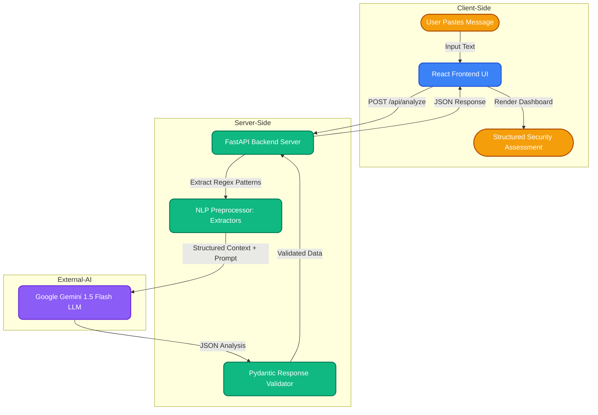

# CyberGuard

<div align="center">
  <a href="https://git.io/typing-svg"></a>
</div>

> Analyze suspicious messages and understand the signals behind them.

CyberGuard is an academic prototype demonstrating how Natural Language Processing and conversational AI can support cybersecurity awareness. It analyzes suspicious messages and produces a structured security assessment — identifying intent, extracting entities, explaining flagged signals, and suggesting safe next steps.

---

## Problem

Users frequently receive suspicious messages — phishing attempts, fake job offers, delivery scams, and impersonation messages — and lack the tools to quickly evaluate them before acting.

## Objective

Demonstrate how NLP techniques can be applied to a practical cybersecurity use case: analyzing message content to help users make informed decisions before responding or clicking.

---

## Features

- Paste any suspicious message and receive a structured security assessment
- Detected intent with explanation
- Extracted entities (URLs, organizations, monetary values, OTPs, etc.)
- Flagged indicators with explanations
- Risk level: LOW / MEDIUM / HIGH
- Recommended next steps
- Follow-up conversational Q&A using the current analysis as context
- Analysis history stored locally in browser
- Security guide reference documentation
- Demo mode — fully functional without a Gemini API key
- Responsive design — works on desktop, tablet, and mobile

---

## NLP Concepts Demonstrated

| NLP Concept | CyberGuard Implementation |
|---|---|
| Natural Language Understanding | Understands message meaning and security context |
| Intent Detection | Identifies likely purpose of the message |
| Entity Extraction | Extracts URLs, organizations, OTPs, money, etc. |
| Contextual Interaction | Follow-up questions use the current analysis |
| Information Retrieval | Uses a local cybersecurity knowledge base |
| AI Response Generation | Produces structured explanation and recommendations |
| Task-oriented Dialogue | Guides the user toward safe next actions |

---

## 🧠 How It Works: The Architecture

CyberGuard utilizes a modern, hybrid architecture combining deterministic rule-based preprocessing with advanced Large Language Model (LLM) intelligence.



### 🔍 Step-by-Step Breakdown

1. **User Input:** The user pastes a suspicious message into the intuitive React interface.
2. **Deterministic Preprocessing:** Before invoking the AI, our Python backend runs deterministic regex and pattern matching to instantly flag obvious indicators like URLs, email addresses, OTP mentions, or urgency keywords.
3. **LLM Context Generation:** The raw message, alongside the preprocessed indicators, is wrapped into a highly engineered prompt template.
4. **AI Analysis:** Google Gemini 1.5 Flash processes the context, utilizing its vast natural language understanding to perform intent detection and threat classification.
5. **Strict Validation:** The LLM's output is rigidly validated against a Pydantic schema to ensure the response is perfectly formatted JSON before it hits the frontend.
6. **Actionable Insights:** The React frontend parses the structured JSON and renders a beautiful, actionable dashboard displaying risk level, detected intent, extracted entities, and recommended safe next steps.

---

## 🛠️ Tech Stack

<div align="center">
  <a href="https://skillicons.dev">
    
  </a>
</div>

**Frontend**
- React 18 + Vite
- React Router v6
- Vanilla CSS (no framework)

**Backend**
- Python 3.10+
- FastAPI
- Google Gemini 1.5 Flash (`google-generativeai`)
- Pydantic v2

---

## Setup

### Prerequisites

- Node.js 18+
- Python 3.10+
- A Gemini API key (free at [aistudio.google.com](https://aistudio.google.com)) — optional, app runs in demo mode without it

### 1. Clone the repository

```bash
git clone <repo-url>
cd ai_chatbot_cia
```

### 2. Configure environment

```bash
cp .env.example backend/.env
# Edit backend/.env and add your GEMINI_API_KEY
```

### 3. Install backend dependencies

```bash
cd backend
python -m venv .venv
.venv\Scripts\activate     # Windows
# source .venv/bin/activate  # macOS/Linux
pip install -r requirements.txt
```

### 4. Install frontend dependencies

```bash
cd frontend
npm install
```

---

## Running Locally

### Start backend

```bash
cd backend
.venv\Scripts\activate
uvicorn app.main:app --reload --host 0.0.0.0 --port 8000
```

### Start frontend (separate terminal)

```bash
cd frontend
npm run dev
```

Open [http://localhost:5173](http://localhost:5173)

---

## Environment Variables

| Variable | Description | Required |
|---|---|---|
| `GEMINI_API_KEY` | Google Gemini API key | No — app uses demo mode if absent |

---

## API Endpoints

| Method | Endpoint | Description |
|---|---|---|
| GET | `/api/health` | System status and API configuration |
| POST | `/api/analyze` | Analyze a message |
| POST | `/api/chat` | Follow-up question with analysis context |

Interactive API docs: [http://localhost:8000/api/docs](http://localhost:8000/api/docs)

---

## Demo Mode

CyberGuard includes a full demo mode with pre-built analysis results for five message types:

- Banking phishing → HIGH risk
- Job scam → HIGH risk
- Delivery scam → MEDIUM risk
- Malware message → HIGH risk
- Benign college reminder → LOW risk

Demo mode is automatically enabled when no Gemini API key is configured.

---

## Limitations

- CyberGuard provides an AI-assisted assessment and should not be treated as definitive proof that a message is malicious or safe.
- The system may produce false positives on legitimate urgent messages.
- Novel phishing techniques may not be detected.
- Detection accuracy is not measured or claimed.

---

## Future Improvements

- Multi-language message support
- Browser extension for inline message checking
- Batch analysis mode
- User-reported feedback for improving patterns
- Integration with threat intelligence feeds
